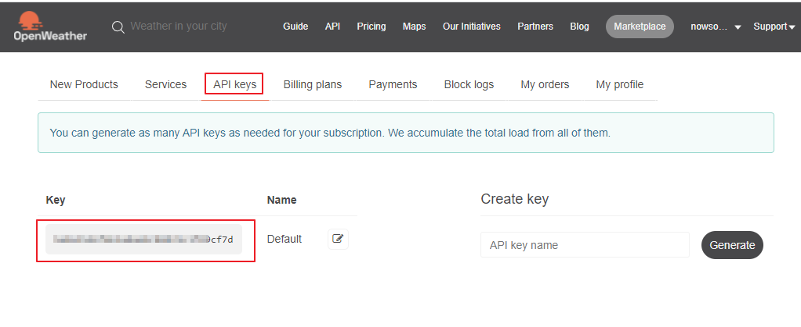

# 현재 위치의 날씨 정보 표시

HTML5의 Geolocation API를 사용하여 사용자의 디바이스의 위치정보인 위도, 경도를 구하고, 현재 위치의 날씨를 Open Weather API를 사용하여 표시하려고 한다. 처음 계획은 구글 API를 사용하여 현재 위치의 도시 이름을 구한 다음에 도시 이름으로 해당 도시의 날씨를 알아보려고 했는데 구글 맵 API가 유료로 전환이 되어서 위치정보로 날씨정보를 가져오는 것으로 계획을 변경했다.

아래 정보는 Geolocation API를 사용한 위치 정보와, 해당 위치의 날씨 정보를 표시한 것이다.

| 위도 | 경도 | 날씨 | 현재 온도 |
| -- | -- | -- | ----- |
|    |    |    |       |

## 위치 정보 구하기

현재 앱이 실행되고 있는 디바이스의 위치정보는 window.navigator.geolocation.getCurrentPosition() API를 사용하여 구할 수 있다. 파라미터는 성공했을 때 처리할 콜백 함수와 실패했을 때 처리할 콜백 함수가 필요하다.

geolocation을 지원하지 않는 브라우저가 있을 수 있으므로 객체 탐지를 통해서 지원하는 경우에만 동작하도록 한다. 대략적인 코드는 다음과 같을 것이다.

```javascript
function successCallback(event) {
  // 성공했을 때 처리 
}
function errorCallback(event) {
  // 실패 했을 때 처리 
}

window.addEventListener('load', () => { 
  if(window.navigator.geolocation) {  // geolocation을 지원하는지 확인
     window.navigator.geolocation.getCurrentPosition(successCallback,errorCallback)
  }
```

위치 정보는 위도와 경도로 표시되는데 success callback 함수에 전달되는 event 객체의 coords 객체체에서 구한다.

```javascript
function successCallback(event) {
  var latitude  = event.coords.latitude   // 위도
  var longitude = event.coords.longitude  // 경도
}
```

## 날씨 정보 가져오기

### API Key 발급받기

날씨 정보는 OpenWeatherMap이라는 싸이트의 API를 통해서 가져올 것이다.

[날씨 Open API](https://openweathermap.org)

아래의 순서대로 진행하여 API Key를 발급받는다.

* 사이트에 가입을 한다.
* 확인 메일이 자신의 메일박스로 날라온다. (근데 메일이 아직 안왔다. 좀 더 기다려 보기로 하자.)
* 자신의 메일에서 확인버튼을 클릭한다.
* API Keys 링크를 클릭하여 사이트로 이동한다. 
* 기본적으로 키가 하나 생성되어 있다. 복사한다.



[날씨 Open API API Key 확인](https://home.openweathermap.org/users/sign_in)

### 서울 날씨 정보 요청해 보기

브라우저에서 일단 City ID로 서울의 날씨 요청해 본다. appid는 자신의 API Key를 입력해야 한다.

```shell
https://api.openweathermap.org/data/2.5/weather?id=1835847&appid=xxxx
```

좌표를 이용하여 현재 날씨 정보를 가져온다.

```shell
api.openweathermap.org/data/2.5/weather?lat={lat}&lon={lon}&appid={API key}
```

응답값이 JSON으로 돌아온다.응답으로 돌아 온 데이터를 이용하여 날씨정보를 표시할 것이다.

```json
{
	"coord": {
		"lon": 127,
		"lat": 37.5833
	},
	"weather": [
		{
			"id": 802,
			"main": "Clouds",
			"description": "scattered clouds",
			"icon": "03d"
		}
	],
	"base": "stations",
	"main": {
		"temp": 301.14,
		"feels_like": 301.02,
		"temp_min": 299.95,
		"temp_max": 301.98,
		"pressure": 1014,
		"humidity": 43
	},
	"visibility": 10000,
	"wind": {
		"speed": 2.52,
		"deg": 205,
		"gust": 4.07
	},
	"clouds": {
		"all": 40
	},
	"dt": 1622606023,
	"sys": {
		"type": 1,
		"id": 8096,
		"country": "KR",
		"sunrise": 1622578334,
		"sunset": 1622630880
	},
	"timezone": 32400,
	"id": 1835847,
	"name": "Seoul",
	"cod": 200
}
```

응답값의 주요 필드는 다음과 같다.

| 필드                      | 설명     |
| ----------------------- | ------ |
| main.temp               | 현재온도   |
| main.humidity           | 현재 습도  |
| weather\[0].main        | 날씨     |
| weather\[0].description | 날씨 설명  |
| weather\[0].icond       | 날씨 이미지 |

현재온도는 섭씨온도를 만들기위해 273을 빼야 한다.

### 날씨 이미지

날씨이미지도 지원 한다. 응답 데이터의 icon 을 사용하면 된다. 큰 이미지와 작은 이미지를 지원한다.

```javascript
// 작은 이미지 
var imgURL = "http://openweathermap.org/img/wn/" + resp.weather[0].icon + ".png";
// or
// 큰 이미지
var imgURL = "http://openweathermap.org/img/wn/" + resp.weather[0].icon + "@2x.png";
```

이미지가 맘에 안들면 아래 링크의 이미지를 사용할 수 있다. 대신 매핑로직을 작성해야 한다.

[날씨 이미지](https://erikflowers.github.io/weather-icons/)

아이콘 정보는 아래 URL에서 확인할 수 있다.

[날씨 아이콘 정보](https://openweathermap.org/weather-conditions)

## Source Code

### HTML

```markdown
| 위도 | 경도 | 날씨 | 현재 온도 | 
|--|--|--|--|
| <span id="latitude"></span>|<span id="longitude"></span> || <span id="tempr"></span> |
```

### Javascipt

```javascript
function showLocation(event) {
  var latitude = event.coords.latitude 
  var longitude = event.coords.longitude
  document.querySelector("#latitude").textContent = latitude
  document.querySelector("#longitude").textContent = longitude 

  
  let apiKey = "yourkey"
  let weatherUrl = "https://api.openweathermap.org/data/2.5/weather?lat=" + latitude 
                + "&lon=" + longitude 
                + "&appid=" + apiKey; 

	let options = { method: 'GET' }
  ajax(weatherUrl, options).then((response) => {
      console.log(response)
      let icon = response.weather[0].icon
      let iconUrl = "http://openweathermap.org/img/wn/" + icon + "@2x.png"
      let img = document.querySelector("#wicon")
      img.src = iconUrl 
      document.querySelector("#tempr").textContent = (response.main.temp) + "(" + (response.main.temp - 273) + ")" // 현재 온도
    }).catch((error) => {
      console.log(error)
    })
}

function showError(event) {
  alert("위치 정보를 얻을 수 없습니다.")
}

window.addEventListener('load', () => { 
  if(window.navigator.geolocation) {
     window.navigator.geolocation.getCurrentPosition(showLocation,showError)
  }

})


<!-- CODE SECTION -->

<script src="/assets/js/framework/http.js"></script>
<script>
function showLocation(event) {
  var latitude = event.coords.latitude 
  var longitude = event.coords.longitude
  document.querySelector("#latitude").textContent = latitude
  document.querySelector("#longitude").textContent = longitude 

  
  let apiKey = "yourkey"
  let weatherUrl = "https://api.openweathermap.org/data/2.5/weather?lat=" + latitude 
                + "&lon=" + longitude 
                + "&appid=" + apiKey; 

	let options = { method: 'GET' }
  ajax(weatherUrl, options).then((response) => {
      console.log(response)
      let icon = response.weather[0].icon
      let iconUrl = "http://openweathermap.org/img/wn/" + icon + "@2x.png"
      let img = document.querySelector("#wicon")
      img.src = iconUrl 
      document.querySelector("#tempr").textContent = (response.main.temp) + "(" + (response.main.temp - 273) + ")" // 현재 온도
    }).catch((error) => {
      console.log(error)
    })
}

function showError(event) {
  alert("위치 정보를 얻을 수 없습니다.")
}

window.addEventListener('load', () => { 
  if(window.navigator.geolocation) {
     window.navigator.geolocation.getCurrentPosition(showLocation,showError)
  }

})
```
